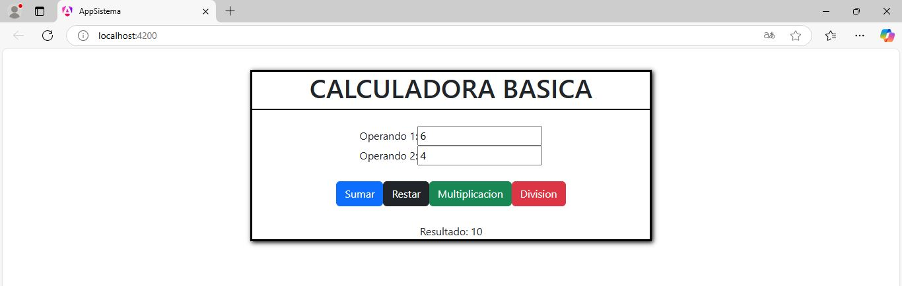

# CALCULADORA

Aplicando lo aprendido con Angular he realizado una calculadora basica que 
realiza las 4 operaciones que son: **SUMA**, **RESTA**, **MULTIPLICACIÓN** Y **DIVISIÓN**
-- 
## IMAGEN DE LA CALCULADORA
